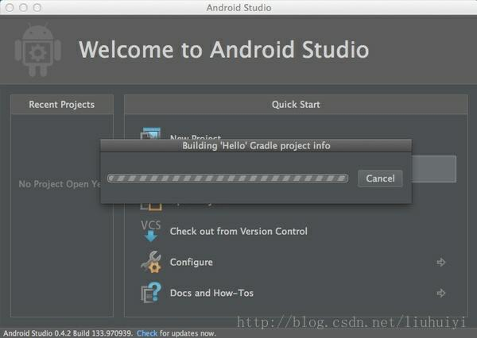
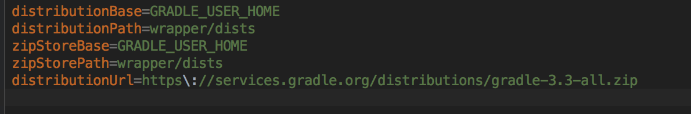
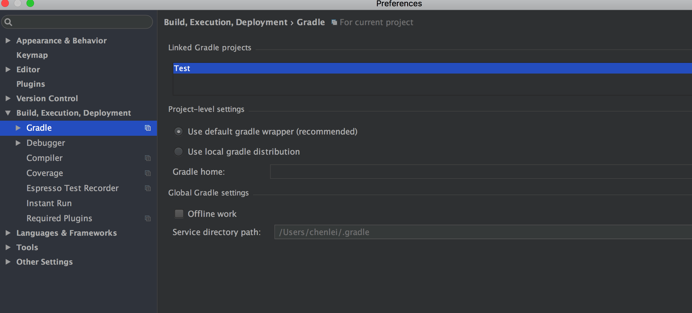
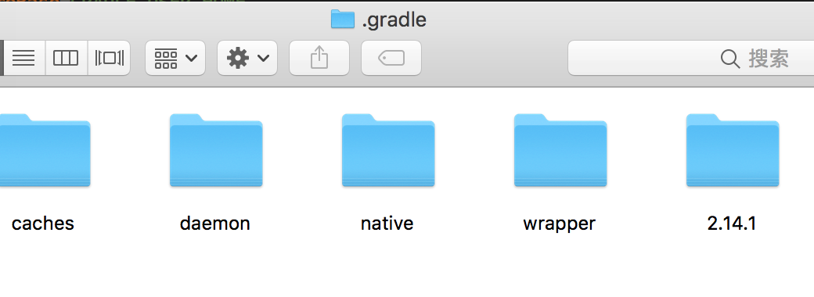

# MacOS 环境下，离线安装AndroidStudio
----
[back](./)

###第一次创建项目，和在github上下载项目，本地运行出现下面这种情况的时候

**停留在这个画面的原因是因为下载gradle包出现了问题，原因也只能归结于方老师的红色高墙了，不过在线不能安装可以离线安装嘛。**

#### 1.定位你新建项目的gradele版本：
点开项目中gradle文件夹 => 点开 gradle-wrapper.properties =>distributionUrl=https\://services.gradle.org/distributions/gradle-3.3-all.zip   
我这里项目的gradle版本是    _gradle-3.3-all.zip_

#### 2.去官网下载这个版本（不要下载错了）：http://services.gradle.org/distributions

#### 3.找到离线gradle文件放置的目录：

进入到AS项目，点击左上角AndroidStudio =>Preferences =>Build,Execution,Deployment=>下面有个Gradle选项 =>

	
Service directory path：就是graddle文件所在目录
我这里的目录是 /Users/chenlei/.gradle

#### 4.进入你本地gradle文件目录  快捷键命令：command+空格键  然后输入你刚才的路径=>回车键

然后 点击wrapper => dists => 然后直接把下载的gradle 压缩文件（不要解压）拷贝到/dists/gradle-3.3-all/55gk2rcmfc6p2dg9u9ohc3hw9 （你第一次创建项目的时候，AndroidStudio会自动去下载gradle，会在dists文件夹生成类似gradle-3.3-all/55gk2rcmfc6p2dg9u9ohc3hw9的文件夹的）

#### 5.重启Android Studio,打开项目即可。

